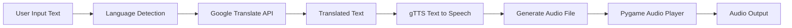
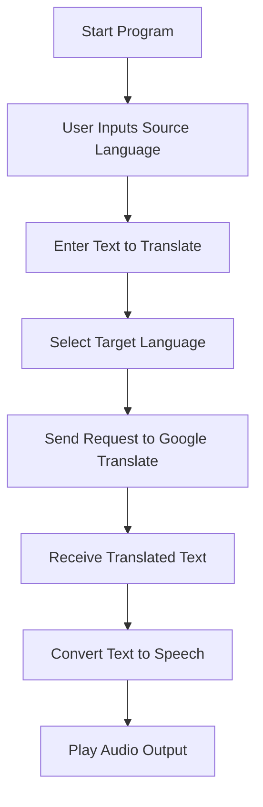
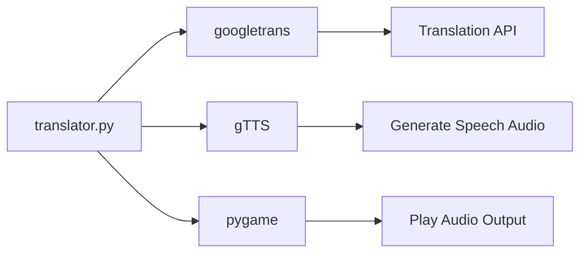

# 🌍 Multilingual Translator with Speech

<p align="center">


</p>

<p align="center">
A Python-based multilingual translator that converts text between <b>100+ languages</b> and generates speech output using <b>Google Text-to-Speech</b>.
</p>

---

# 🚀 Features

✔ Translate text between **100+ languages**
✔ Automatically detect **language name or code**
✔ Convert translated text to **speech output**
✔ Play translated speech using **Pygame audio engine**
✔ Simple **command-line interface**
✔ Lightweight and easy to run

---

# 🧭 System Architecture



---

# 📊 Translation Workflow



---

# 🧠 Module Interaction



---

# 🛠 Technologies Used

| Technology  | Purpose                   |
| ----------- | ------------------------- |
| Python      | Core programming language |
| googletrans | Language translation      |
| gTTS        | Text-to-speech generation |
| pygame      | Audio playback            |
| CLI         | User interaction          |

---

# 📂 Project Structure

```
multilingual-translator-with-speech/

translator.py        # Main translation program  
requirements.txt     # Project dependencies  
README.md            # Project documentation  
.gitignore           # Ignore cache and audio files  
```

---

# ⚙️ Installation

Clone the repository

```bash
git clone https://github.com/akankshacore/multilingual-translator-with-speech.git
```

Navigate to the project folder

```bash
cd multilingual-translator-with-speech
```

Install dependencies

```bash
pip install -r requirements.txt
```

---

# ▶️ Run the Program

```bash
python translator.py
```

---

# 💻 Example Usage

```
Enter the language you want to translate from: english
Enter the word or phrase to translate: how are you
Enter the language you want to translate to: french

Translation: Comment allez-vous
```

🎧 Audio Output:
The system will automatically generate and play the translated speech.

---

# 📦 Requirements

Install dependencies manually if needed

```bash
pip install googletrans==4.0.0-rc1 gTTS pygame
```

---

# 🔮 Future Improvements

• Add graphical interface using **Tkinter / PyQt**
• Support **real-time speech input**
• Add **translation history storage**
• Improve **language detection accuracy**

---

# 👩‍💻 Author

**Akanksha**

---

⭐ If you found this project useful, consider **starring the repository**.
